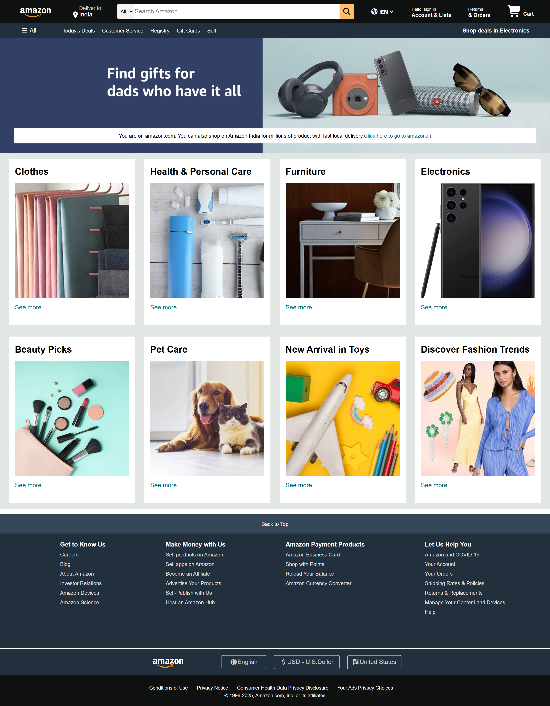

# Amazon Clone

This is a **simple Amazon homepage clone** built using only **HTML and CSS**.  
It replicates the layout, navigation, and product sections of Amazon's main page.

## 🔧 Technologies Used
- HTML5  
- CSS3  
- VS Code

## 🧩 Features
- Amazon-style navigation bar  
- Hero section with banner image  
- Product categories with images  
- Fully structured layout

## 📷 Screenshot

> ✨ Note: All images used are for educational and non-commercial purposes only.

## 📁 How to Use
1. Clone the repo or download the ZIP  
2. Open `index.html` in your browser

## 🧑‍💻 Author

**Vaibhav Umesh Velhal**  
📧 [vaibhav.velhal1614@gmail.com](mailto:vaibhav.velhal1614@gmail.com)
